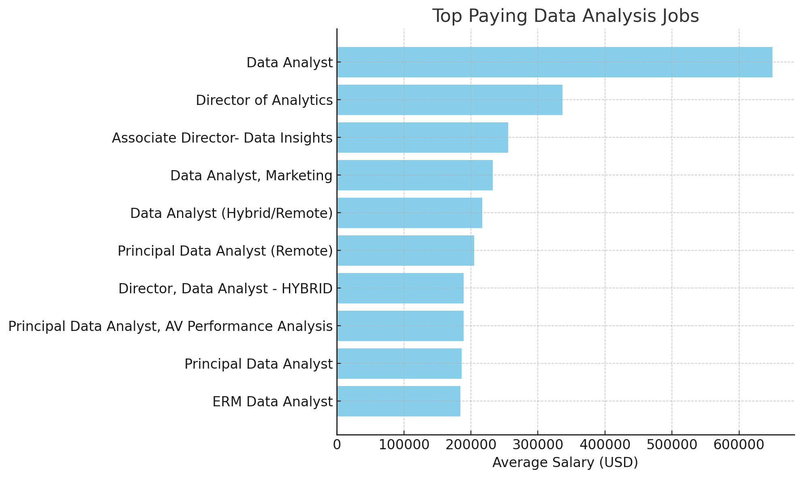
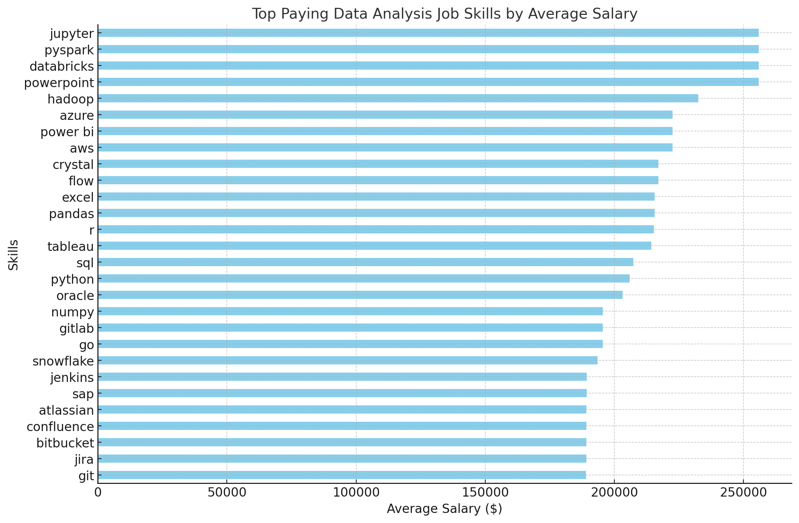
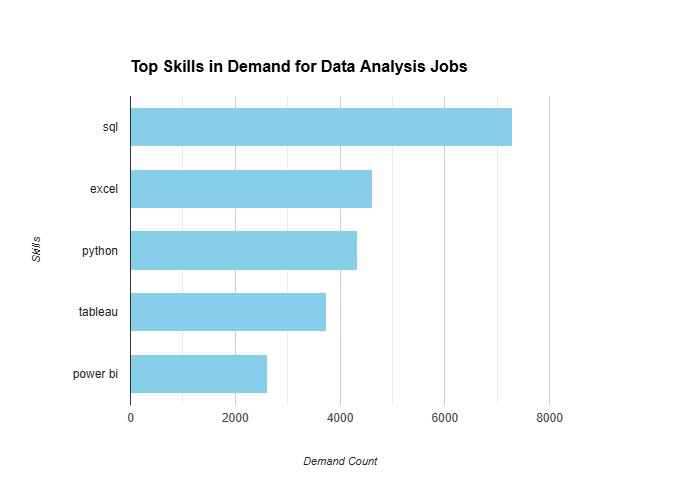
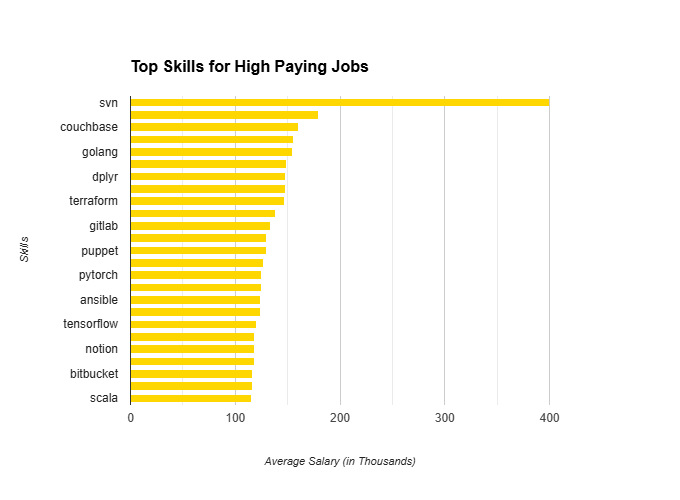
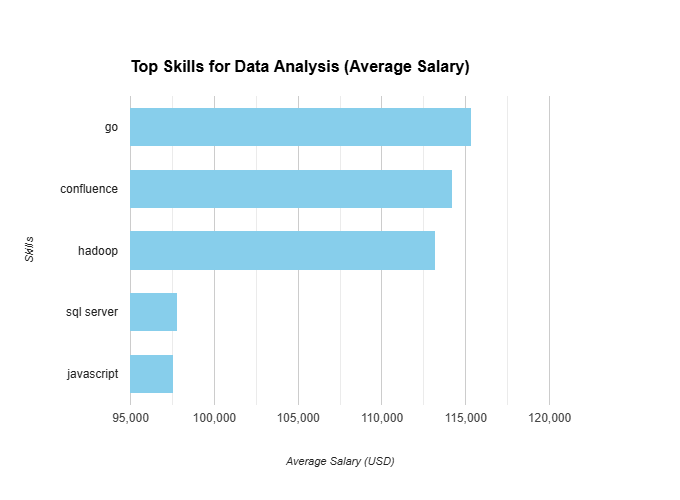

# SQL Project: Data Job Analysis 📊💻

## Introduction
The "SQL Project: Data Job Analysis" aims to explore and analyze job data to identify the most in-demand skills in data-related professions. 🚀 With the rapid growth of the data industry, understanding which skills are most sought after can help aspiring data professionals align their learning paths with industry needs. This project uses SQL to extract insights from job postings, focusing on trends, skills, and employer demands that drive the data job market. 🔍📈

SQL queries? Check them out here: [Sql_project folder](Sql_project)

## Background
Driven by a quest to navigate the data analyst job market more effectively, this project was born from a desire to pinpoint top-paid and in-demand skills 💡📈, streamlining others' work to find optimal jobs 🧭💼.

## Tools I Used 🛠️
- **SQL** 🗃️: Used for querying and analyzing the dataset.
- **PostgreSQL** 🐘: The database management system for storing and handling the data.
- **VS Code** 💻: The code editor used for writing and running SQL scripts.
- **Git** 🌱: Version control to manage project changes and collaborate effectively.

## Data Analysis Queries

This repository contains a set of SQL queries related to data analysis jobs and skills. Below are the details and descriptions of each query.

### 1. Top Paying Data Analysis Job 💼💰
This query identifies the data analysis role with the highest earning potential. It compares salaries across various data roles such as Data Scientist, Data Engineer, and Business Intelligence Analyst, highlighting the position offering the highest compensation.

```sql
SELECT 
    job_id,
    job_title,
    job_location,
    job_schedule_type,
    salary_year_avg,
    job_posted_date,
    name as company_name
FROM 
    job_postings_fact
LEFT JOIN company_dim ON job_postings_fact.company_id = company_dim.company_id
WHERE 
    job_title_short = 'Data Analyst' AND
    job_location = 'Anywhere'  AND
    salary_year_avg is NOT NULL
ORDER BY
    salary_year_avg DESC
LIMIT
    10;
```


### 2. Top Paying Data Analysis Job Skill 💡💵
This query examines the key skills that command the highest salaries in data analysis jobs. It focuses on in-demand skills such as advanced machine learning, big data technologies, and expertise in tools like SQL, Python, and R, which are valued highly in well-paying roles.
```sql

WITH top_paying_jobs AS (
SELECT 
    job_id,
    job_title,
   
    
    salary_year_avg,
    
    name as company_name
FROM 
    job_postings_fact
LEFT JOIN company_dim ON job_postings_fact.company_id = company_dim.company_id
WHERE 
    job_title_short = 'Data Analyst' AND
    job_location = 'Anywhere'  AND
    salary_year_avg is NOT NULL
ORDER BY
    salary_year_avg DESC
LIMIT
    10
)

SELECT top_paying_jobs.*,
skills
FROM top_paying_jobs
INNER JOIN skills_job_dim ON top_paying_jobs.job_id = skills_job_dim.job_id
INNER JOIN skills_dim ON skills_job_dim.skill_id = skills_dim.skill_id
ORDER BY salary_year_avg DESC;
```


### 3. Top Skills for Data Analysis 🛠️📊
This query outlines the essential skills that every data analyst should have to perform their tasks effectively. Skills like proficiency in SQL for data querying, expertise in data visualization tools like Tableau, and statistical analysis are key to becoming an efficient data analyst.
```sql
SELECT
skills,
job_title_short,
COUNT(skills_job_dim.job_id) AS demand_count
FROM job_postings_fact
INNER JOIN skills_job_dim ON job_postings_fact.job_id = skills_job_dim.job_id
INNER JOIN skills_dim ON skills_job_dim.skill_id = skills_dim.skill_id 
WHERE
job_title_short = 'Data Analyst'
 AND job_work_from_home = True
GROUP BY
skills,
job_title_short
ORDER BY
demand_count DESC
LIMIT 5
```


### 4. Top Skill for High Paying Job 🚀📈
This query targets the most important skill that drives high-paying opportunities in data analysis. The result focuses on skills such as machine learning, cloud computing, or deep programming expertise, which are critical for securing high-level, lucrative data analysis roles.

```sql
SELECT
skills,
ROUND(AVG(salary_year_avg),0)AS avg_salary
FROM job_postings_fact
INNER JOIN skills_job_dim ON job_postings_fact.job_id = skills_job_dim.job_id
INNER JOIN skills_dim ON skills_job_dim.skill_id = skills_dim.skill_id 
WHERE
job_title_short = 'Data Analyst'
 AND salary_year_avg IS NOT NULL
GROUP BY
skills

ORDER BY
avg_salary DESC
LIMIT 25
```

### 5. Optimal Skills for Data Analysis 🔑⚙️
This query explores the best combination of technical and soft skills for data analysts to perform optimally. It combines coding proficiency, data manipulation, problem-solving, and communication skills, ensuring success in various analytical tasks and making a data analyst highly effective.
```sql

SELECT
skills_dim.skill_id,
skills_dim.skills,
COUNT(skills_job_dim.job_id) AS demand_count,
ROUND (AVG(job_postings_fact.salary_year_avg), 0) AS avg_salary
FROM job_postings_fact
INNER JOIN skills_job_dim ON job_postings_fact.job_id = skills_job_dim.job_id 
INNER JOIN skills_dim ON skills_job_dim.skill_id = skills_dim.skill_id
WHERE
job_title_short = 'Data Analyst'
AND salary_year_avg IS NOT NULL
AND job_work_from_home = True
GROUP BY
skills_dim.skill_id
HAVING
COUNT(skills_job_dim.job_id) > 10
ORDER BY
avg_salary DESC, 
demand_count DESC
LIMIT  25;
```

## What I Learned

Throughout this adventure, I've turbocharged my SQL toolkit with some serious firepower:

- **Complex Query Crafting:** Mastered the art of advanced SQL, merging tables like a pro and wielding `WITH` clauses for ninja-level temp table maneuvers.  
- **Data Aggregation:** Got cozy with `GROUP BY` and turned aggregate functions like `COUNT()` and `AVG()` into my data-summarizing sidekicks.  
- **Analytical Wizardry:** Leveled up my real-world puzzle-solving skills, turning questions into actionable, insightful SQL queries.

## Project Reflection

This project enhanced my SQL skills and provided valuable insights into the data analyst job market. The findings from the analysis serve as a guide to prioritizing skill development and job search efforts. Aspiring data analysts can better position themselves in a competitive job market by focusing on high-demand, high-salary skills.

This exploration highlights the importance of continuous learning and adaptation to emerging trends in the field of data analytics.


